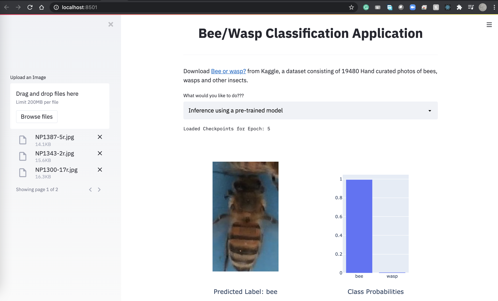
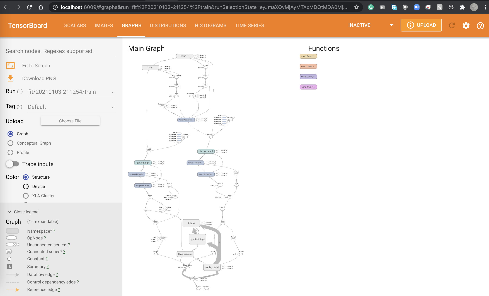
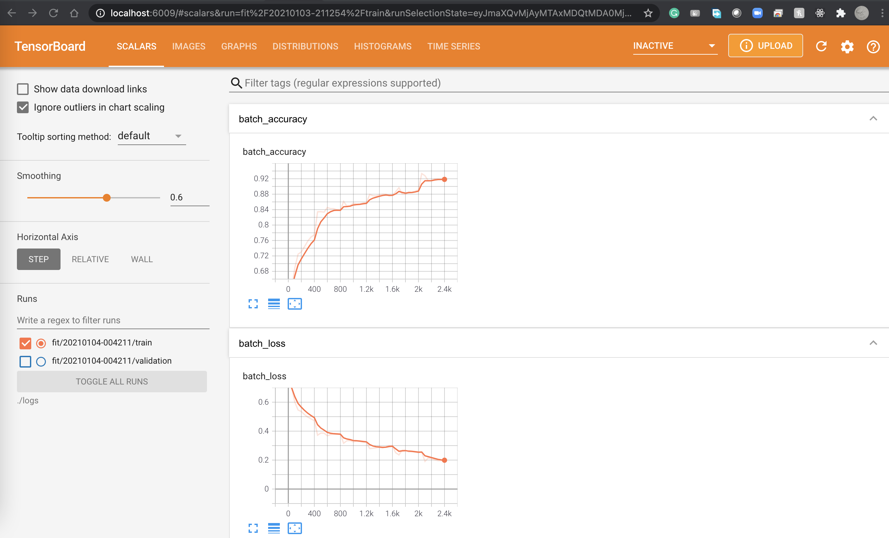

# Bees vs Wasp Classification

A binary classification application to train a Deep Neural Network to classify Bees and Wasps from respective images.

**Check our notebook on Kaggle for the detailed Procedure:** [https://www.kaggle.com/soumikrakshit/binary-classification-youtube-dl-tutorial-1](https://www.kaggle.com/soumikrakshit/binary-classification-youtube-dl-tutorial-1)

## Instructions to build project

1. Download [Bee or wasp?](https://www.kaggle.com/jerzydziewierz/bee-vs-wasp) dataset from Kaggle.

2. `git clone https://github.com/soumik12345/Youtube-DL`

3. `cd binary-classification`

4. `python3 -m pip install -r requirements.txt`

5. `chmod +x ./run.sh`

6. `./run.sh`

## Experiments

**Experiment Link:** [https://tensorboard.dev/experiment/xpPVnLFXRaWZNoM9ePFmiw](https://tensorboard.dev/experiment/xpPVnLFXRaWZNoM9ePFmiw)

### Screenshots

